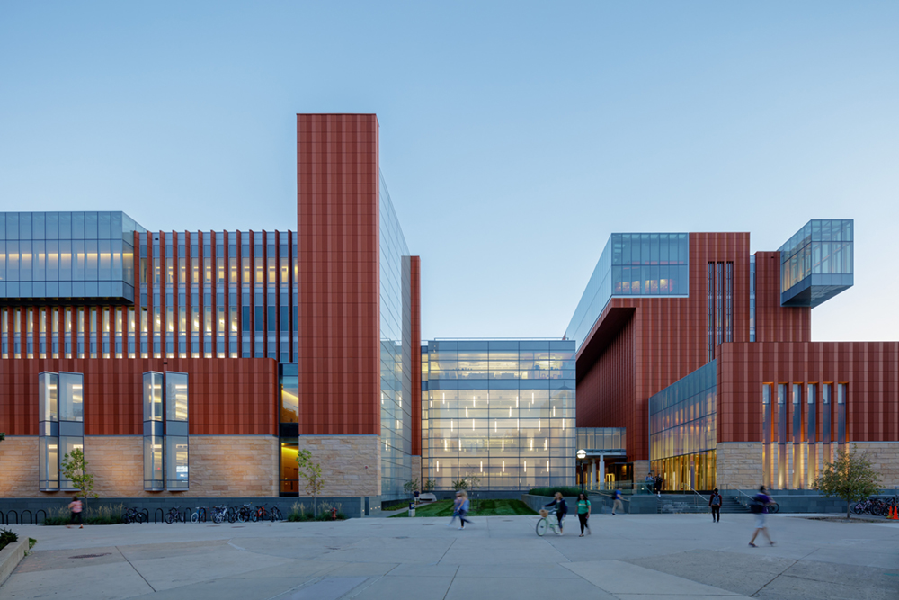
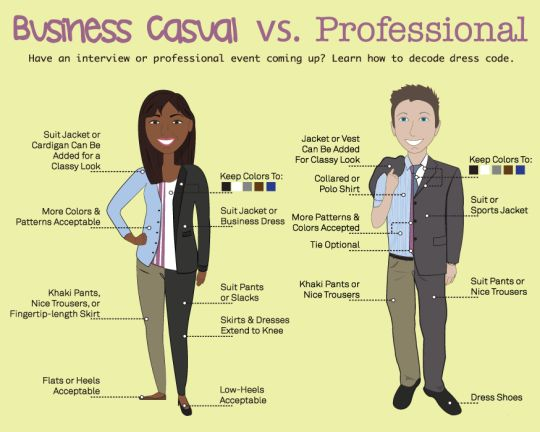

# Intro to Ross MBAn

Welcome!

Congratulations on your acceptance into the MBAn and welcome to Ross! As you already know, the Stephen M. Ross School of Business is a school within the University of Michigan. It is where you’ll take your classes, meet with professors, and do most of your work. Given how much time you’ll spend here, it is imperative that you learn some of the norms and unspoken rules that govern everyday life at Ross. This chapter does just that!

Before diving into the content, a couple of fun facts about Ross:

- Its unique architecture is inspired by corporate headquarters, so students feel comfortable when joining the workforce

```{r echo=FALSE, fig.cap="", fig.align='center', out.width = '65%'}

```

- The Starbucks inside of Ross is the most profitable Starbucks per square foot in the United States

## Classes

### Format

Even though there isn’t an official policy, most Ross classes have some sort of participation grade. Students are expected to prepare for class by doing the required readings and assignments, and professors expect active participation. Many times, professors will rely on **cold calling** or the practice of asking a question directly to a student without any time to prepare.

Another important aspect of Ross classes is the emphasis on **group projects** and team work. Since business school is all about preparing for the real world, professors prepare classes in a way that simulates the outside business environment. Working in teams is an essential component of life, so most classes will include a significant amount of it. More information on how to best prepare for this under Chapter 12 - Preparing for Projects.

### Michigan Time

If you look at your class schedule, you might find that a class might end at the same time as your next class starts. So, how will you walk across the Ross building and be on time? The answer is that classes operate under Michigan time. What that means is that professors end their class 10 minutes early so a class that goes from 2:00 to 3:30 PM will actually end around 3:20 PM.

## Dress Code

### Day-to-Day

There is not an official dress code but students should show up in a presentable manner. Especially during the fall when recruiters visit campus, students are encouraged to dress professionally. 

### Class Presentations

For class presentations, students might be required to dress business casual. This is usually only the case for final presentations and not for shorter ones, but students should make sure to ask their professor beforehand. Below you can see a picture showing what business casual and business professional attire look like.

```{r echo=FALSE, fig.cap="", fig.align='center', out.width = '50%'}

```

## Study Spaces

As mentioned in earlier chapters related to booking Ross study rooms, students must check into the room within 10 minutes of their reservation start time. So students usually make sure to be all ready to go by the time their reservation ends so the next group can check in.