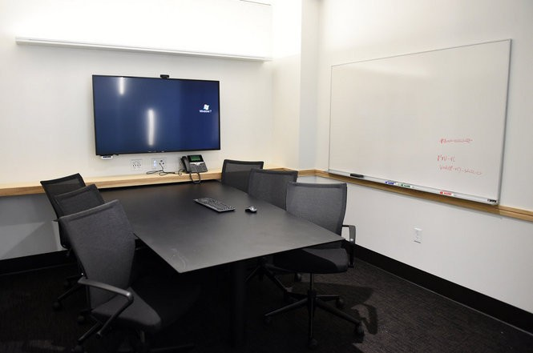
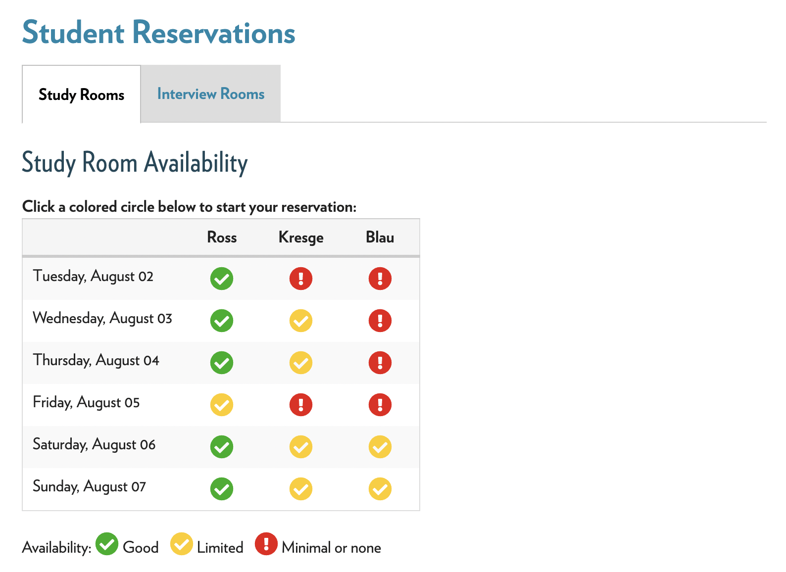
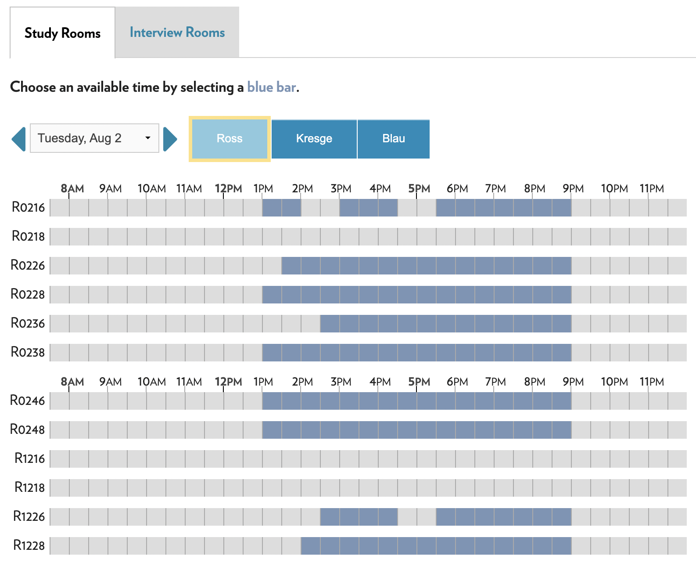
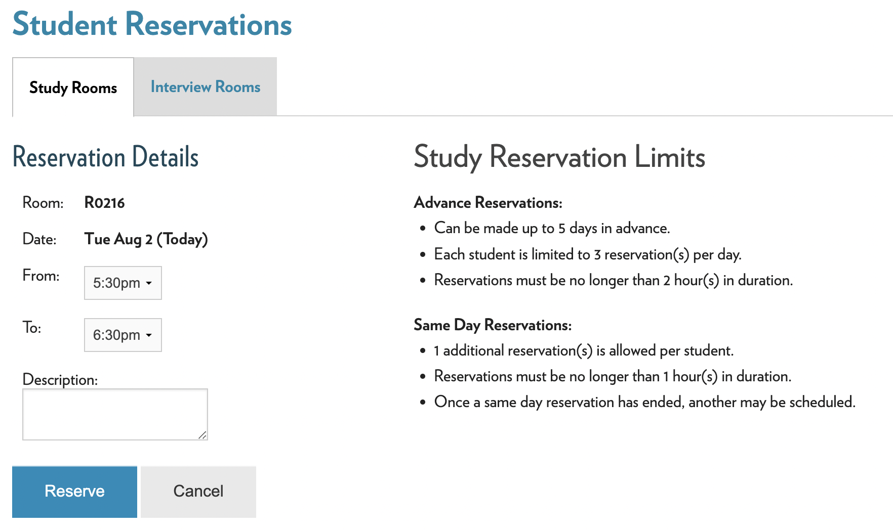
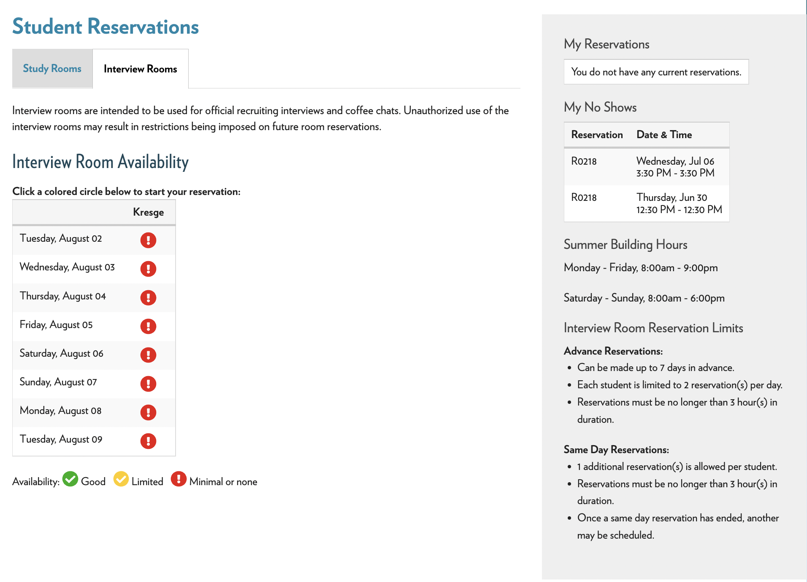
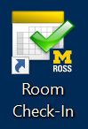
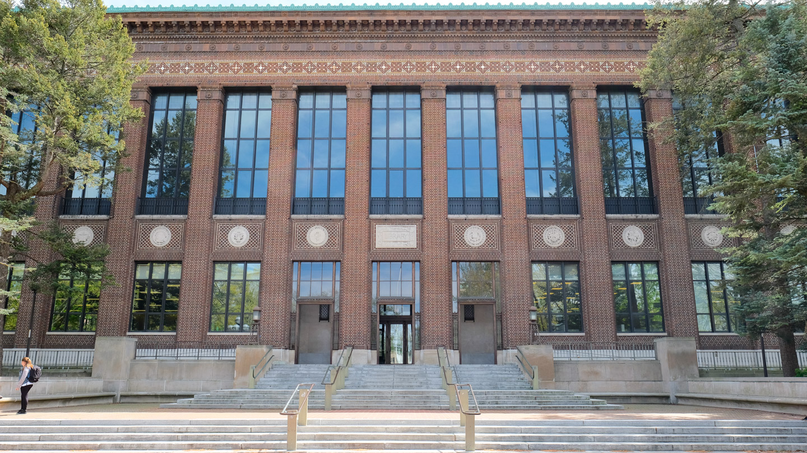
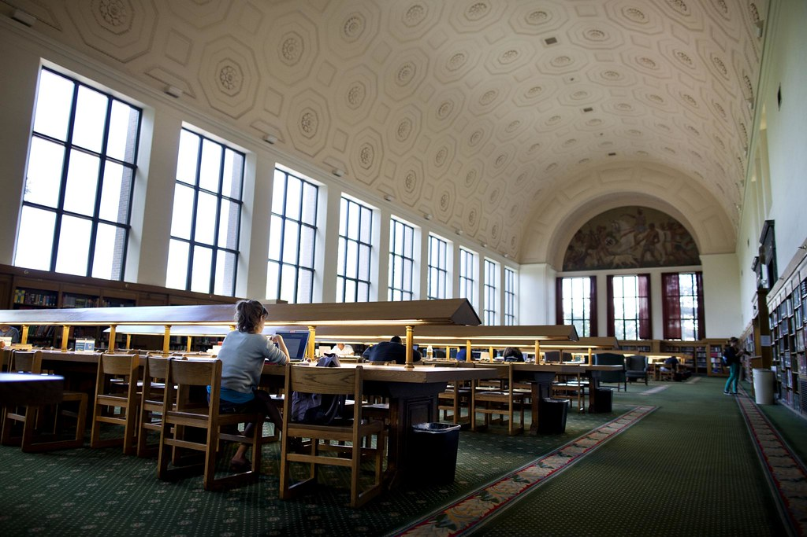

# Places to Study
Given the work you'll be doing during your time as an MBAn student here at Ross, it's great to know where you're able to study around the Ross building. Especially during the fall, when more students will be on campus, it might help to look outside of the scope of Ross to find a nice, quiet study spot.


## Booking Rooms
The first and best resource for Ross students when it comes to studying is booking study rooms. These rooms have anywhere from 6 to 10 seats in them, and are perfect for studying in groups or for quiet studying. The rooms come with a desk and chairs, whiteboards on either side, and are equipped with a computer and monitor that's great for collaborative work.

```{r echo=FALSE, fig.cap="", fig.align='center', out.width = '80%'}

```

To book a study room, first you have to visit the central hub for Ross students, [Impact](https://www.bus.umich.edu/myimpact/home.aspx).

Once you've logged into Impact, there will be a button on the right side of the webpage that looks like this.

```{r echo=FALSE, fig.cap="", fig.align='center', out.width = '80%'}

```

Once you land on that page, you will see an interface that looks like this.

```{r echo=FALSE, fig.cap="", fig.align='center', out.width = '80%'}

```

This lets you know, at a glance, the level of availability in each of the Ross buildings by day of the week. By clicking on one of the circular icons, you will be greeted with another interface.

```{r echo=FALSE, fig.cap="", fig.align='center', out.width = '80%'}

```

By clicking on the block of time that you would like to reserve, you will be taken to a final page that asks for confirmation of booking.

```{r echo=FALSE, fig.cap="", fig.align='center', out.width = '80%'}

```

An important thing to note about reserving these rooms are the rules about how many reservations you can make, how far in advance you can make them, and how many you're allowed to make which are in the picture above.


## Interview Rooms

Another type of room available to Ross students, is the interview room. These rooms are not for studying, but for professional interviews and networking. By going to the same "reserve a room" page as before, you can switch tabs to make an interview room reservation the same way you made a study room reservation. The rules for these rooms are a bit different, which you can see below.

```{r echo=FALSE, fig.cap="", fig.align='center', out.width = '80%'}

```

## Checking in to your room

At either a study room or an interview room, you have to check in within 10 minutes of arrival. The check-in system ensures that students aren't abusing the ability to reserve rooms. The room reservation system works on a three strike policy, so be sure to sign in once you're there!

```{r echo=FALSE, fig.cap="", fig.align='center', out.width = '20%'}

```


## Libraries around campus.

While the study rooms and interviews are a great resource, they're also very popular and fill up quickly. Thankfully, there are a plethora of libraries around campus to study in as well!

One of the best places for quiet study outside of Ross is the [Hatcher Graduate Library](https://lib.umich.edu/locations-and-hours/hatcher-library).

```{r echo=FALSE, fig.cap="", fig.align='center', out.width = '80%'}

```

Located just on the south of the Diag, this library has two of the best silent study spaces available on campus. The Reference Reading Room, located on the second floor of the building, has plenty of seating in a grand hall for quiet study. 

```{r echo=FALSE, fig.cap="", fig.align='center', out.width = '80%'}

```

But if studying around others isn't your style, check out the Hatcher South Carrels on the 3rd, 4th, and 5th floors of the building! Referred to by many as the "stacks" (although the Hatcher Stacks are technically at the bottom of the building), these enclosed study rooms provide a desk, a chair, and plenty of solitude for getting work done.

```{r echo=FALSE, fig.cap="", fig.align='center', out.width = '80%'}
knitr::include_graphics("stacks.png")
```

While the Hatcher Graduate Library has what we think are some of the best study spots on campus, there are plenty more that we aren't able to cover in this book. For more study spaces around campus, check out this article from Campus Information [here!](https://campusinfo.umich.edu/article/study-spots)