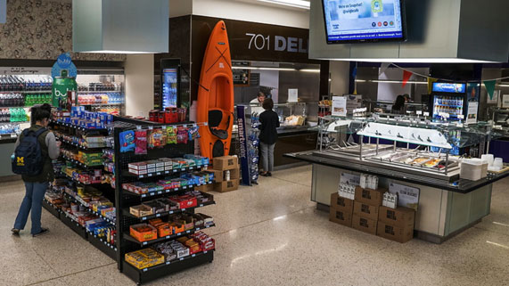
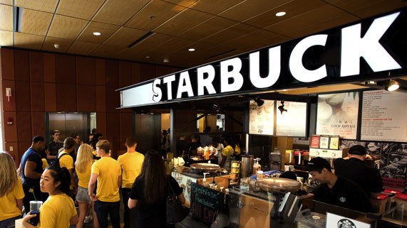
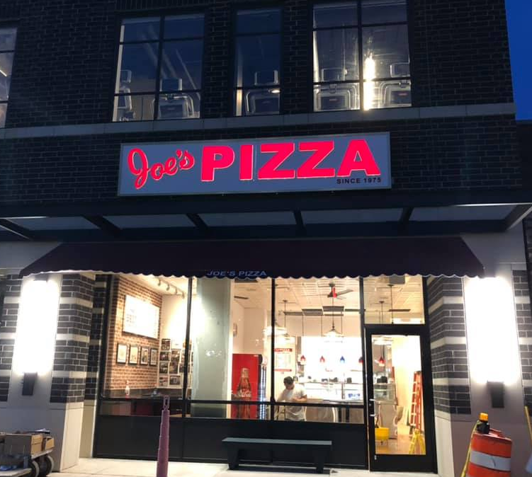
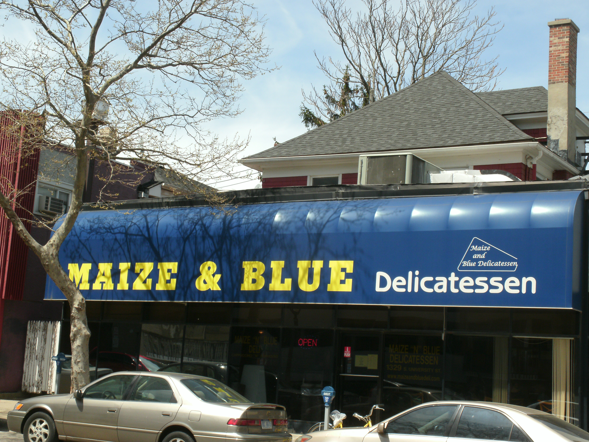
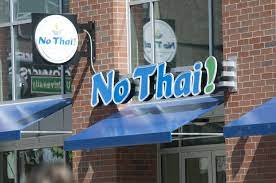

# Eating at Ross

Great options for a meal or a snack within walking distance of Ross.

## Seigle Cafe

```{r echo=FALSE, fig.cap="", fig.align='center', out.width = '60%'}

```

Quick and convenient cafeteria style restaurant located in the Ross Wintergarden. Great option for a quick meal in between classes. 

Meal Options: 
* Delicious Grill Items
* Weekly Grill Specials
* Grab-N-Go Sandwiches and Parfaits
* Build Your Own Salad Bar
* Cold Drinks, Coffee and Fresh Fruit
* Assorted Snacks

Also have online ordering here: [http://michiganross.aramarkcafe.com] (http://michiganross.aramarkcafe.com)

## Starbucks

```{r echo=FALSE, fig.cap="", fig.align='center', out.width = '60%'}

```

Located on the first floor next to the Wintergarden, Starbucks is always a great option for morning breakfast and a coffee. 

## Joe's Pizza

```{r echo=FALSE, fig.cap="", fig.align='center', out.width = '60%'}


```

New York style pizza brought to downtown Ann Arbor!  The secondary location of the famous New York pizza restaurant that is a perennial top 10 listing in restaurant guides and publications such as Time Out New York and New York Magazine. Offering pizza by the slice and by the pie. A five minute walk from Ross, Joe's is a great option for lunch or dinner. 

Location: 1107 S University Ave, Ann Arbor, MI 48104

## Maize and Blue Delicatessen

```{r echo=FALSE, fig.cap="", fig.align='center', out.width = '60%'}

```

While the famous Zingerman's Deli is a must when visiting Ann Arbor, Maize and Blue Delicatessen is a close runner up if you are looking for a great deli-style sandwiches, and it's only a 5 minute walk from Ross.

We recommend the 'Sherry's Chicken Cutlet', 'Maize ‘N Blue Awning' and the 'Triple Play Reuben' sandwiches but be prepared for leftovers.

Location: 1329 S University Ave, Ann Arbor, MI 48104


## No Thai 

```{r echo=FALSE, fig.cap="", fig.align='center', out.width = '60%'}


```

A favorite of students, No Thai is local spot that specializes in preparing noodles, stir-fries & other familiar Thai dishes. About a 7 minute walk from Ross. 

Our personal favorites are the Sweet and Spicy Chicken and the Pad Kana.

Location: 1300 S University Ave #3, Ann Arbor, MI 48104

