# Important Ross Websites

We found that with so much information, we all struggled to understand where to go when we needed to make an appointment with a career coach or book a study room for a group meeting. Therefore, this chapter focuses on the different websites that will become indispensable during your time at Ross.

## iMpact

Link: https://www.bus.umich.edu/myimpact/Home.aspx

This website is exclusively for Ross students and it has a variety of functions:
- Book study and interview rooms as well as managing those bookings
- Create a resume using a template designed by Ross and then publishing that resume for companies and ross members to see
- Access a Ross alumni directory
- Contains links to other websites like Ross Recruit (see below)

### How to book Ross study and interview rooms:

1. Log into iMpact recruit and click the “Reserve a Room” on the right side of the screen
```{r echo=FALSE, fig.cap="", fig.align='center', out.width = '75%'}
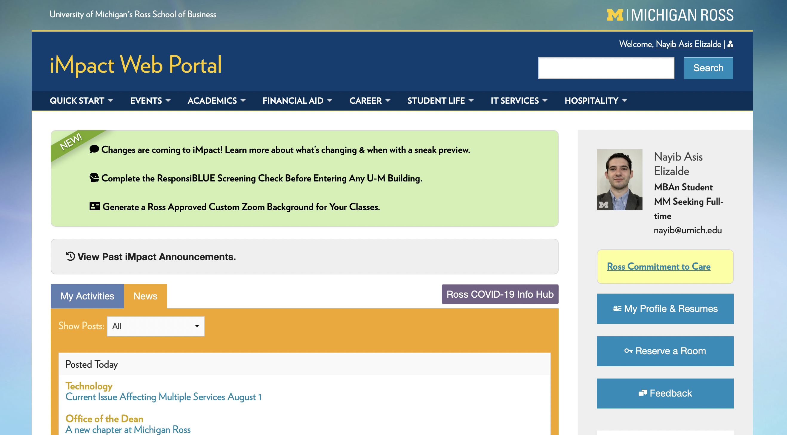
```
2. Click on the circle for the day and building that you want to book your appointment for
```{r echo=FALSE, fig.cap="", fig.align='center', out.width = '75%'}
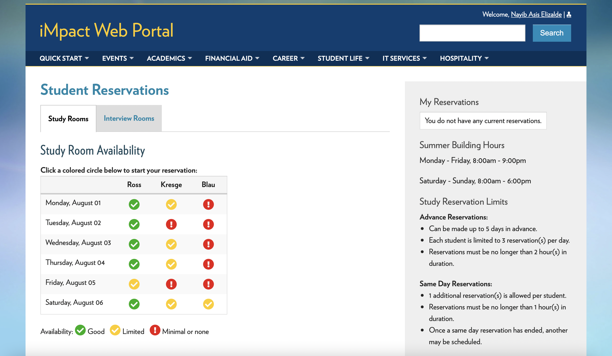
```
3. Click on the block with the starting time you want your reservation for
```{r echo=FALSE, fig.cap="", fig.align='center', out.width = '75%'}
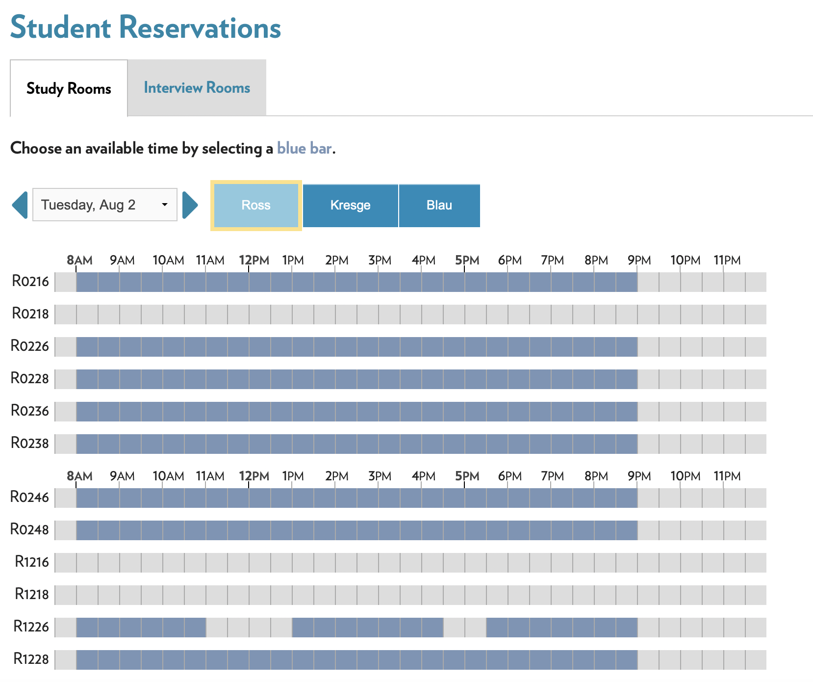
```
4. Fill out the required information and click on “Reserve”
```{r echo=FALSE, fig.cap="", fig.align='center', out.width = '75%'}
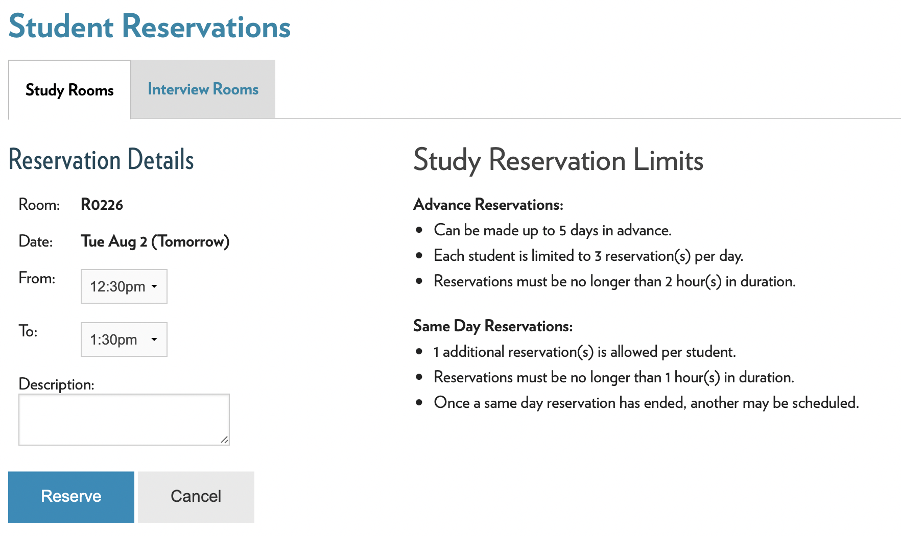
```

## Ross Recruit

Link: https://michiganross.12twenty.com/dashboard

This website is a career resource for Ross students exclusively. It allows students to apply to jobs for companies that recruit directly from Ross and sign up for informational sessions with said companies. Additionally, through this portal, students can sign up for appointments with coaches from the Career Development Office (CDO). You can sign up for appointments with peer coaches as well.

### How to sign up for coaching appointments:

1. Log into Ross recruit and click the “Appointments Tab” on the left side of the screen
```{r echo=FALSE, fig.cap="", fig.align='center', out.width = '75%'}
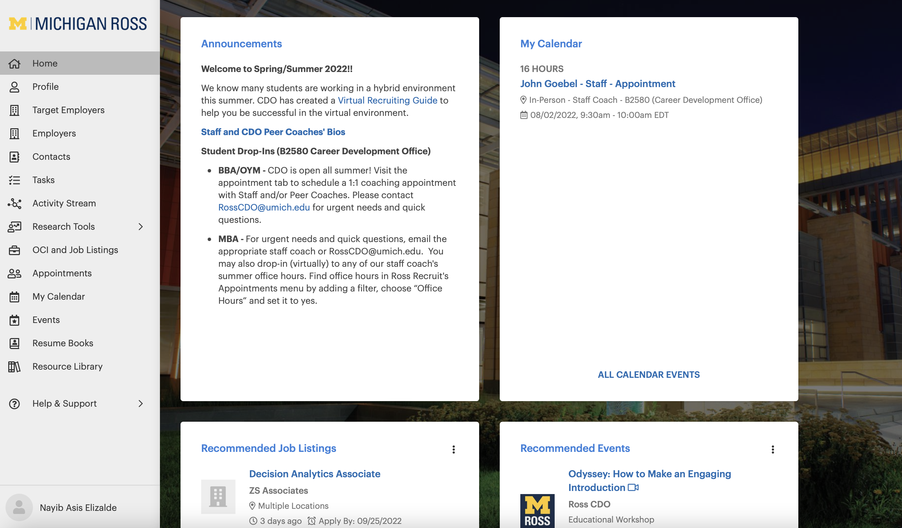
```
2. You will see available appointments for up to a week in advance, and you can filter your search using the search bar on top. Click on the person you want to make the appointment with.
```{r echo=FALSE, fig.cap="", fig.align='center', out.width = '75%'}
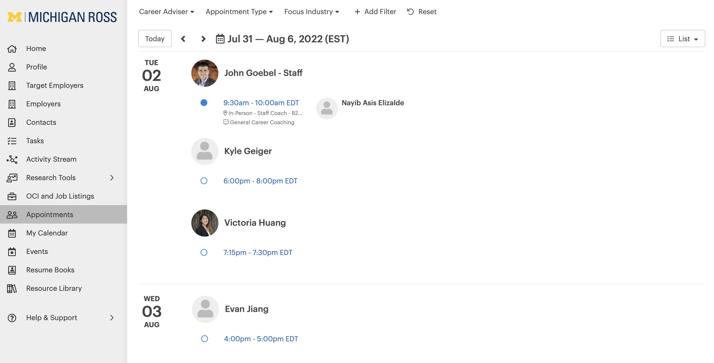
```
3. Click on “Book Appointment”
```{r echo=FALSE, fig.cap="", fig.align='center', out.width = '75%'}
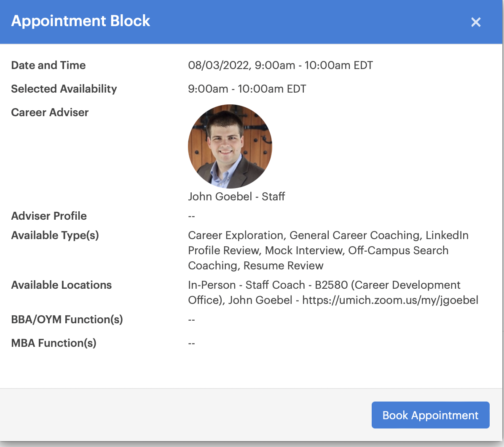
```
4. Fill out the require information and then on “Book Appointment”
```{r echo=FALSE, fig.cap="", fig.align='center', out.width = '75%'}
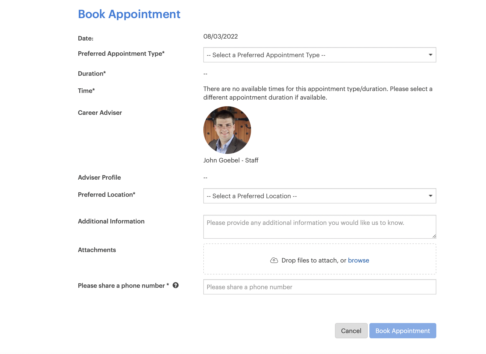
```

## MPrint

Link: https://mprint.umich.edu

This website allows students to print using any campus printer

### How to print:

1. Use the Mprint link and click on “Set a Destination” on the left side of the screen
```{r echo=FALSE, fig.cap="", fig.align='center', out.width = '75%'}
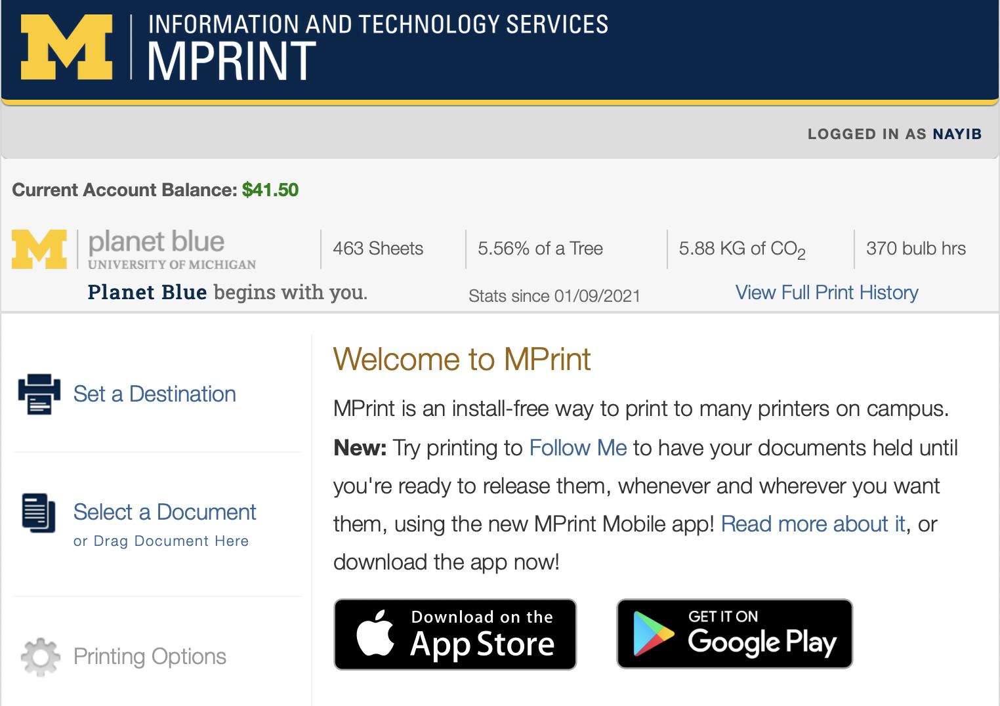
```
2. Under “Find a Printer” click “Choose a destination” and then use the search bar to find the right printer
```{r echo=FALSE, fig.cap="", fig.align='center', out.width = '75%'}
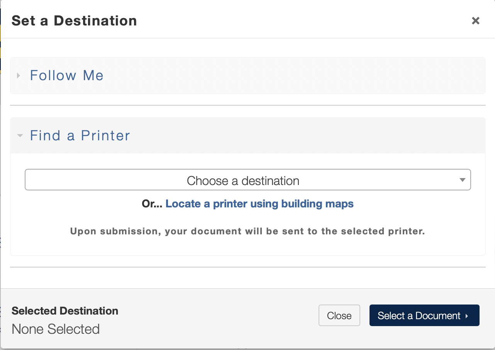
```
3. Click on “Upload File” to look for the file in your computer and then click “Printing Options”
```{r echo=FALSE, fig.cap="", fig.align='center', out.width = '75%'}
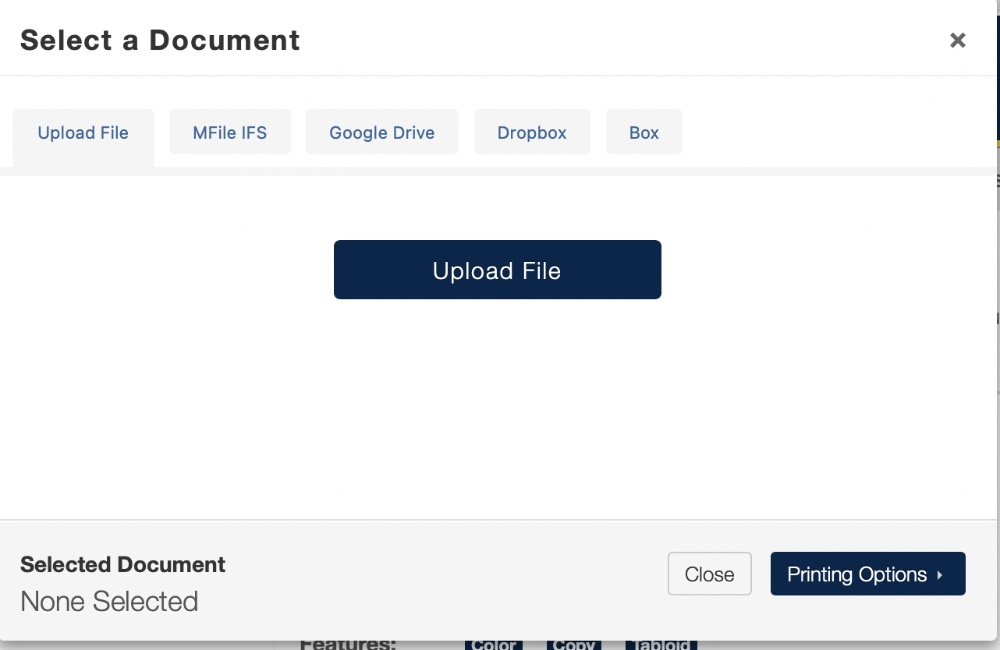
```
4. Fill out the required information and click on “Print Document”
```{r echo=FALSE, fig.cap="", fig.align='center', out.width = '75%'}
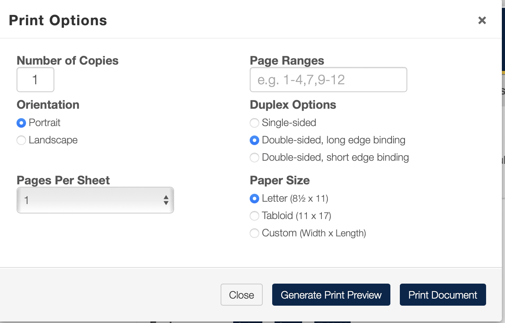
```

## Canvas

Link: https://canvas.umich.edu

Canvas is a portal for your different classes. Each class has its own page where you can see most of the information necessary for said class. More specifically, Canvas is the place to:
- Turn in assignments
- Check grades
- Access class materials
- Receive announcements and messages from professors
- And anything else related to day-to-day class updates

## Handshake

Link: https://umich.joinhandshake.com/login

While Handshake is not a site exclusively for the University of Michigan, there is a specific portal (see link above) for Michigan students. Handshake is a web portal where companies announce job postings and specify different requirements for the job including who can apply, salary range, job description, materials needed to apply, and contact information. Handshake also allows you to message recruiters directly on the website and to add companies to your “saved list” in order to get notifications of new job postings and company events.

