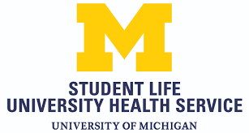

# UHS and Campus Health Services

## University Health Services (UHS)
```{r echo=FALSE, fig.cap="", fig.align='center', out.width = '40%'}

```

University Health Services is your campus health and wellness resource, offering comprehensive clinical services plus support for your well-being. And most services are free for currently enrolled U-M students. 

Located at 207 Fletcher St, the UHS building is about a ten minute walk from Ross. 

Services available: 

* Allergy, Immunization and Travel Health
* Eye Care and Optical Shop
* Gynecology
* Health Education
* Laboratory
* Medical Clinics
* Nutrition Clinic
* Pharmacy
* Physical Therapy
* Radiology
* Specialty Clinics (e.g. Dermatology) Testing for HIV, STI, TB, etc. 

Appointments: You can self-schedule your appointment 24/7 by logging into [www.myuofmhealth.org](www.myuofmhealth.org) and clicking on "visits" or calling 734-764-8320. 

For any other questions check out their website: [uhs.umich.edu](uhs.umich.edu)

## Counseling and Psychological Services (CAPS) 
```{r echo=FALSE, fig.cap="", fig.align='center', out.width = '60%'}
knitr::include_graphics("download-2.png")
```

Counseling and Psychological Services (CAPS) provides confidential mental health services for currently enrolled U-M undergraduate and graduate students.

Located on the fourth floor of the Michigan Union (530 South State Street), the CAPS office is a 5 minute walk from Ross.

Services include:

* Short-term counseling for individual students or couples
* For urgent concerns, walk-in services and 24-hour phone support (call 734-764-8312) 
* Workshops and groups for support and learning new coping skills
* Assessment of substance abuse patterns (ASAP) and eating patterns

Appointments: You can schedule an appointment through their website: [caps.umich.edu/article/scheduling-appointment](caps.umich.edu/article/scheduling-appointment)

Urgent/Crisis Needs: Call CAPS Front Desk at 734-764-8312 or come into the office


