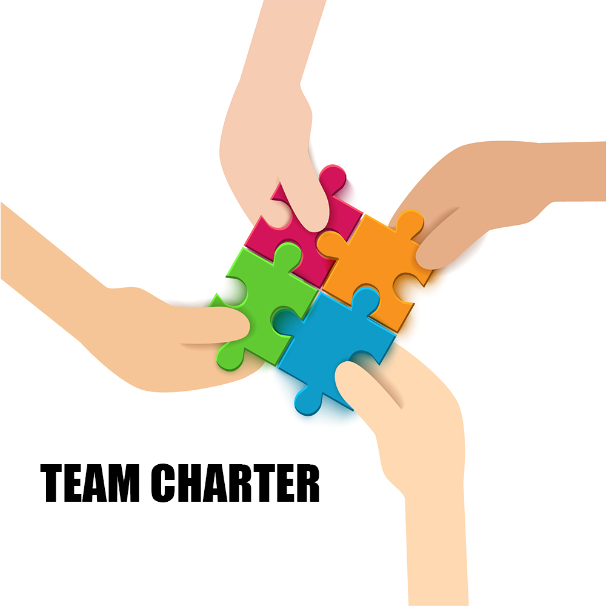

# Preparing for Group Projects and Presentations

In MBAn, most courses have group projects, and many courses don't even have a final exam, instead a final group project or/and final group presentation. As a result, prepare ahead of time for group projects and presentations that will make you more successful in the course. Next, I list some suggestions for participating in group projects at MBAn.

## Create Team Charter Together

```{r echo=FALSE, fig.cap="", fig.align='center', out.width = '70%'}

```

A team charter is a document that defines your team goals, assets, and obstacles. Building a team charter helps your team have a shared vision, have a clear roles and responsibilities, have a clear scope and milestones, and improve the team communication.  A good team charter is the first step and one of the most important steps to be succeed in group project. 

## Get Involved and Build the Relationship

```{r echo=FALSE, fig.cap="", fig.align='center', out.width = '70%'}

```

Participating in team meetings and completing team tasks are, of course, necessary conditions for the success of team projects. In addition to this, it is also important to build relationships with team members within and outside the team. This will make your team happier and more efficient in completing team projects.

## Manage Your Time Properly

```{r echo=FALSE, fig.cap="", fig.align='center', out.width = '70%'}

```

Unlike an undergraduate degree, the MBAn program is particularly tight, with only 7 weeks in a quarter. As a result, you are very likely to encounter periods where multiple team projects are being worked on at the same time. At this time, time management becomes very important. Properly scheduling different team project meetings can bring you one step closer to success.
