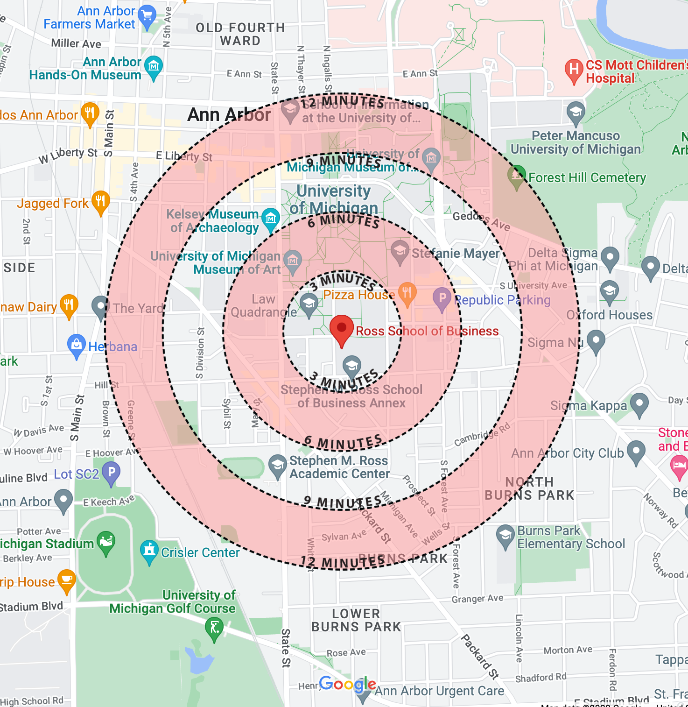
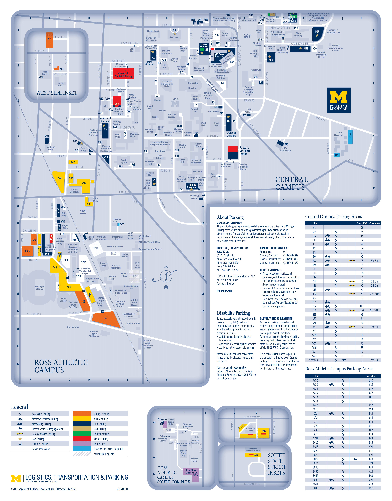
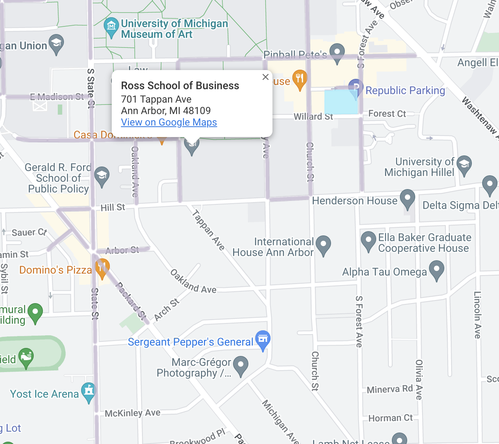
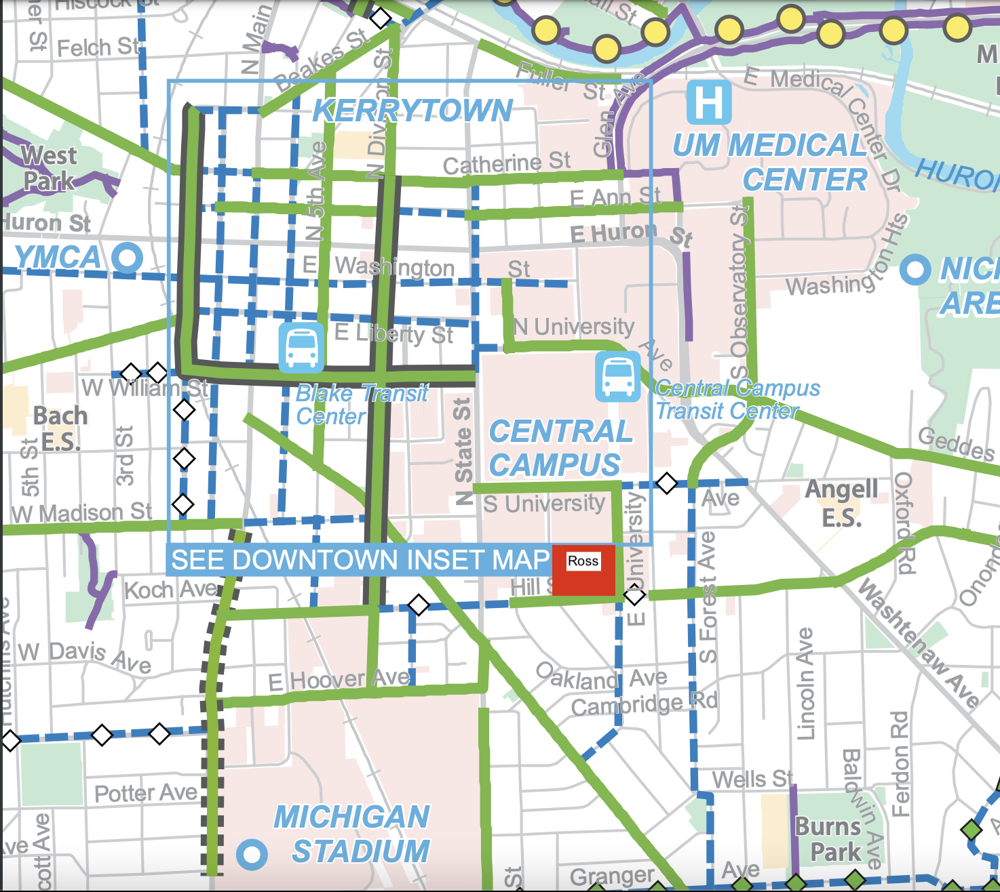

# Transportation
You may be trying to plan out your commute to Ross. Whether you are walking, driving, biking, or taking the bus, here are some helpful tips and resources for you!

## Walking
If you plan on walking to Ross, here is an approximate map of walking times to the Ross School of Business!
```{r echo=FALSE, fig.cap="", fig.align='center', out.width = '80%'}

```

## Busses
There are two types of buses you will encounter: The Michigan (school-run) "Blue Bus" and "TheRide", the Ann Arbor-Yspilanti wide bus system. Both of these buses can take you to the Ross School of Business!

**Blue Buses**

[Here](https://ltp.umich.edu/wp-content/uploads/university-bus-routes.pdf) is a detailed guide, created by the University, towards all University bus routes. For your commute, you will likely be taking either the Commuter North, towards North Campus, or the Commuter South, towards South campus! 

**TheRide**

If the University buses do not provide sufficient service for you, try TheRide! The Ann Arbor city bus is free for all students with just a swipe of your MCard. To plan out your trip, click [here](https://www.theride.org/maps-schedules/trip-planner)!

## Parking

If you plan on driving to Ross, here's what you should know!

**Permits**

As a Graduate Student, you are eligible for a "Yellow/After Hours" Permit. This permit will allow you to park in all Yellow or Orange lots for all hours, and all Blue lots and structures from M-F 3pm - 5am and all day on weekends. Below is a map of all structures and lots around Ross, and [here is an interactive map](https://maps.studentlife.umich.edu/parking)!

The nearest Yellow lots, W32 and W38, are roughly an 8 minute walk from Ross.
```{r echo=FALSE, fig.cap="", fig.align='center', out.width = '80%'}

```

To apply for a permit, go [here](https://ltp.t2hosted.com/cmn/auth_ext.aspx). This annual permit will cost $237 dollars, starting July 1 and will be valid through June 30 of the following year.

**Street Parking**

If you do not want to purchase a permit, you may wish to park on the street! Around Ross, there is metered parking at the rate of $2.20 an hour, Monday-Saturday from 8am - 6pm. If you do not wish to pay metered parking, there is some street parking near the residences South of Ross, but they have 2 or 4-hour parking limits. They are also quite limited! Below is a map of streets, where grey streets offer metered parking, and the streets South of Ross have 2 or 4 hour parking.
```{r echo=FALSE, fig.cap="", fig.align='center', out.width = '80%'}

```


## Biking
Biking to class may be an affordable, easy way to commute to Ross! Many streets around Ross offer bike lanes and/or wide sidewalks for biking. It is recommended to purchase a U-Bike lock in order to deter theifs! You may also want to [register your bike with the Department of Public Safety](https://news.umich.edu/u-m-s-dps-offers-free-online-bicycle-registration/).

Below is a map of biking lanes and streets around Ross. Streets that are colored green have designated biking lanes, while street that are colored blue have shared biking lanes with other vehicles.   

```{r echo=FALSE, fig.cap="", fig.align='center', out.width = '80%'}

```
