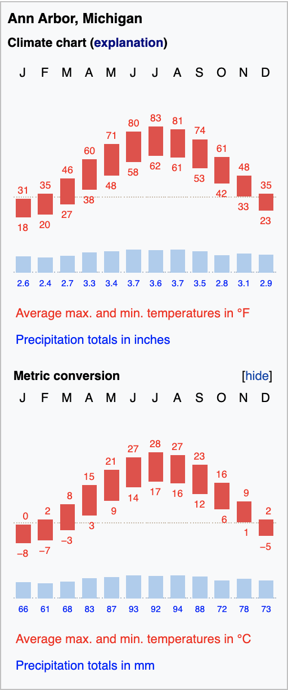
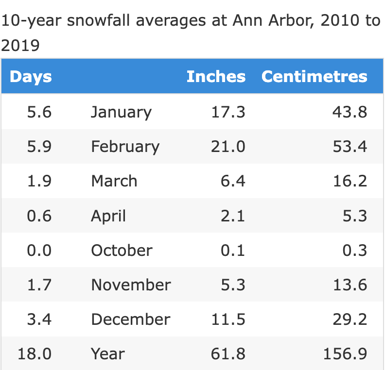

# Preparing for Winter

Winter... you've probably heard bad things about Michigan winter. This chapter serves to give you the facts about how it and tips about how to survive during the winter months!

## Temperature

Here is a chart, showing the range of typical daily highs and lows by month. 
```{r echo=FALSE, fig.cap="", fig.align='center', out.width = '80%'}

```
Here, you can see that winter starts in November, and will not fully end until April! That's about 5 months of the year where you must be prepared to deal with low temperatures.

## Snow and Ice

This chart shows you the average snowfall inches (or centimeters) per month. You can see that we get significant snowfall in December, January, and February.
```{r echo=FALSE, fig.cap="", fig.align='center', out.width = '80%'}

```
We also get ice storms during these months! While data on these is hard to find, expect icy roads and sidewalks during your winter commute to Ross. 

If you are wishing for the possibility of a snowday, don't be excited - we have only had one snowday since 1979! 

## Jackets

You will need a nice winter jacket to survive a Michigan winter. They are worth the investment! It is hard to recommend a single jacket, however some popular brands are:

* [Columbia](https://www.columbia.com/c/technology-omniheatreflective/?)
    + Columbia is relatively affordable, and commonly runs sales on winter gear during the summer!
* [The North Face Men's](https://www.thenorthface.com/en-us/mens/mens-jackets-and-vests-c211702)
* [The North Face Women's](https://www.thenorthface.com/en-us/womens/womens-jackets-and-vests-c211719)
* [Canada Goose](https://www.canadagoose.com/) 
    + Canada Goose is very expensive and a luxury brand! They have great jackets, but whether it's worth it is up to you! You can certainly be comfortable in other brands, so do not feel that you must spend $1000+ on a winter coat.
* [Patagonia](https://www.patagonia.com/shop/jackets)
* [Duluth Trading Co. Men's](https://www.duluthtrading.com/men/outerwear/jackets-and-coats/)
* [Duluth Trading Co. Women's](https://www.duluthtrading.com/women/outerwear/jackets-and-coats/)

And many more! Again, getting a good, warm jacket will be extremely important.

## Layering

While jackets are important, arguably more important is knowing how to properly layer your clothing. Even with a nice jacket, you must wear 2-3 layers in order to survive. That means shirts, hoodies/sweaters, and a jacket as your outer layer!

## Hats and Scarves

Keeping your head and neck warm will be super important! While there are no specific types of hats or scarves to buy, be sure to wear one as temperatures reach freezing.

## Gloves

Gloves are also incredibly important, especially if you are outside for long periods of time. I would recommend purchasing leather or thick gloves, mittens, or touchscreen gloves, for phone use! 

## Snow Boots

You should also purchase snow boots! You definitely do not want to walk around in sneakers during snow storms. Snow boots are definitely worth the investment, some reputable brands are:

* [Timberland's](https://www.timberland.com/)
* [L.L. Bean](https://www.llbean.com/llb/shop/506936?page=winter-boots)
* [Columbia](https://www.columbia.com/c/ski-snow-shoes/)
* [Ugg](https://www.ugg.com/women-weather/)

And more! While the price points of these boots may differ slightly, expect to pay around $100-$200 on boots. This is a lot, however it's worth it! Be sure to look for sales over the summer months, or waiting until Black Friday for sales.