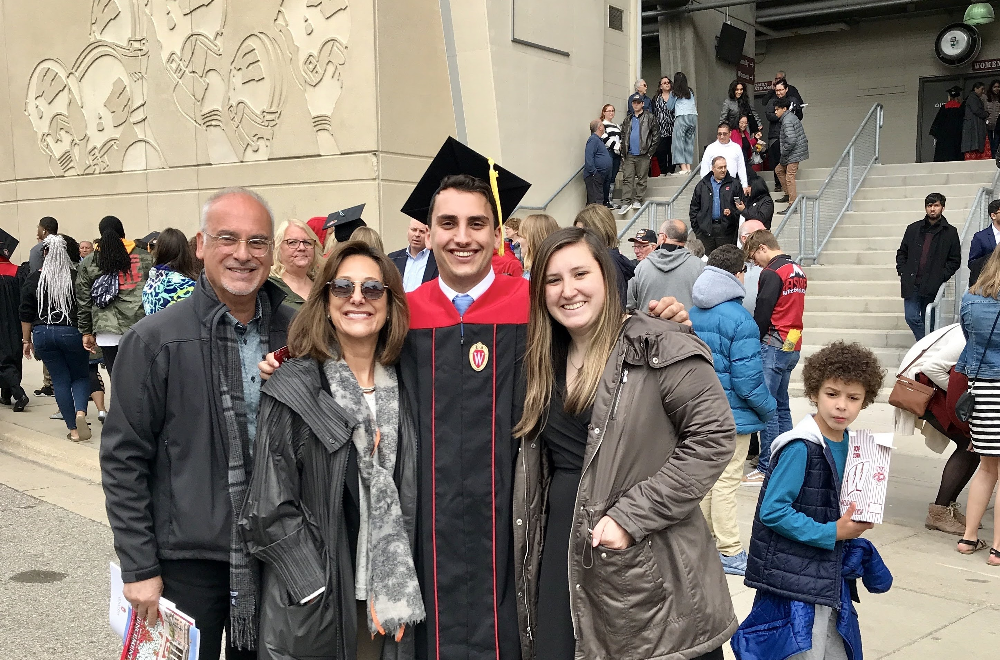

--- 
title: "Woodsmen Test Book"
author: "Alex Finci, Anthony Oliveri, Nayib Asis, Runfan Yan, and Tom Davis"
date: "`r Sys.Date()`"
site: bookdown::bookdown_site
documentclass: book
bibliography: [book.bib, packages.bib]
# url: your book url like https://bookdown.org/yihui/bookdown
# cover-image: path to the social sharing image like images/cover.jpg
description: |
  This is a minimal example of using the bookdown package to write a book.
  The HTML output format for this example is bookdown::gitbook,
  set in the _output.yml file.
link-citations: yes
github-repo: rstudio/bookdown-demo
---

# Intro

**MBAn Student’s Guide to Ross and Ann Arbor**

*~Live, Laugh, Ross~*

Situation and Proposed Solution:

As the first MBAn cohort, with almost every single one of us new to Ann Arbor and the Ross School of Business, we have faced challenges trying to adapt to a new environment. As a result, our group is seeking to help future generations of MBAn’s by creating a detailed guide on Ross and an introduction to the uncontrollable world of business.

Our book will include different sections (listed below) explaining the transition to Ann Arbor, unspoken as well as established rules for navigating Ross, and other pieces of information that our team members have found useful in the last few weeks. We will accomplish this goal by following the principles outlined in our team charter.

<!--chapter:end:index.Rmd-->

---
title: "About Us"
output: html_document
date: "2022-07-23"
---

# About us

Get to know the Woodsmen, and what we're all about!

## Who is Tom Davis?

**"Hello, World!"**

My Name is Tom Davis, I'm from Birmingham, MI, and I am a graduate student at the Ross School of Business working towards my Master of Business Analytics. I came to this program because I love *music*. That might seem strange given we're not playing any instruments, but I think you'd be surprised how similar coding and chords can be.

Music, Business, and Software all require

- *Creativity*
- *Problem Solving*
- and *Language Skills*

In addition, these three things are absolutely **fundamental** to our daily lives. We all utilize software, listen to music, and participate in the uncontrollable world of business every day. My end goal? Live at this intersection to help deliver listeners more of the music they love!


## Who is Alex Finci?

My name is Alex Finci and I am a Master of Business Analytics student in the Ross School of Business at the University of Michigan. I have always been interested in the intersection of data and business and how companies use data analytics to gain insights into consumer behaviors to make business decision. And what better way to learn more about business analytics than through a Masters at Ross!

**Background**

I was born in Los Angeles, where I lived for the first ten years of my life. In 2006, my family moved just north of San Francisco, where my parents and older sister currently reside. I received my undergraduate degree at the University of Wisconsin-Madison, where I majored in Economics. I enjoy being active and playing sports, including basketball, tennis and golf. I am avid fan of Los Angeles' sports teams. I also like to hike and travel.


```{r echo=FALSE, fig.cap="", fig.align='center', out.width = '80%'}

```

## Who is Anthony Oliveri?

I am from Long Island, New York and I currently live in Ann Arbor, Michigan as I am a Masters student at UM-Ann Arbor. I moved to Michigan in 2018 for my undergraduate education!


**Credentials**

I graduated with a  B.A. in Economics from Michigan in 2022 and now I am a  Master of Business Analytics student at the University of Michigan - Ross School of Business. Go Blue!

**Goals**
I am passionate about data and I hope to learn how to contribute significant analyses in the future.

**Hobbies**

- All Sports! I watch Basketball, Baseball, and Football, but I will play almost any sport! My favorites to play are basketball, baseball, and volleyball.

- Video Games

- Hiking, Traveling, and Exploring

**Links**

- [LinkedIn](https://www.linkedin.com/in/anthony-oliveri1/)

- [Facebook](https://www.facebook.com/anthony.oliveri.6/)

- [Instagram](https://www.instagram.com/aoliveri8/)

## Who is Nayib Asis Elizalde?

I was born and raised in *Monclova, Mexico*, where I lived with my parents and older sister until I turned 15. I then moved to the United States for school and have been here since (9th year)! I currently live in *Ann Arbor, MI*.

I graduated from *Dartmouth College* in 2020 (via Zoom) where I majored in Political Science focusing on Latin American politics. While there, I was part of different admissions and orientation groups, a Paganucci Fellow at the Tuck School of Business, and part of the executive board of my fraternity.

After college, I obtained my Master of Management with distinction from the *Ross School of Business* at the *University of Michigan*. I am currently pursuing a Master of Business Analytics also from Ross, and I served the program's student association as a Students Relations co-chair.

**Career Interests**

In the past, I have worked on different projects with Latin American companies seeking to tackle complex social issues through innovation. As a Paganucci Fellow working with Innova Schools in Peru and an intern at Dalberg Advisors doing consulting work in Mexico and Colombia, I learned about problem-solving, the role that businesses play in today’s world, and how integrating new technology can lead to ground-breaking solutions.

In the future, I hope to pursue a career that allows me to have some sort of impact in the lives of others.


**Other Interests and Fun Facts**

- Going on runs (I am trying to run a half marathon this year)

- Traveling to new places (really excited for for a trip to Florence this year)

- Reading (I read 30 books in 2021)

- Having fun with friends

- My favorite quote: "If you don't have a seat at the table, bring a folding chair."

## Who is Runfan Yan?

My name is Runfan Yan. I am from Ningbo, China and currently live in Ann Arbor as a master student in University of Michigan.


**Personal Information**

- Mobile: 971-717-1702

- Email: runfanyan@gmail.com

**Education Background**

University of Denver, BS in Business Administration, Major: Business Analytics, Minor: Mathematics, 09/2017 - 06/2021

University of Michigan, Master of Business Analytics, 06/2022 - 04/2023

**Internship Experience**

KPMG China, Tax Management Consulting Intern, 08/2021-11/2021

- Assisted to draft the solutions for incentive and tax consulting inquiry for clients and complied relevant materials

- Responsible for solving client’s problem of Tax e-Token update with repeated coordination with Tax Bureau, Bank of China, and KPMG departments; helped to identify the core issue and executed possible solutions

- Reviewed clients’ materials for the application of digitalization and intelligence demonstration; summarized the operation conditions to fulfill the requirement of declaration report   

**Hobbies**

- Playing Badminton

- Swimming

- Reading

- Traveling

- Playing the piano

**Fun fact about me**

- I have been playing the piano since I was four years old

- I once raised two parrots, but unfortunately they flew away inadvertently

<!--chapter:end:01-AboutUs.rmd-->

---
title: "Ross Administration"
output: html_document
date: "2022-07-23"
---

# Ross Administration

## Buildings

## Program Directors, Deans, and Professors

<!--chapter:end:02-RossAdministration.Rmd-->

---
title: "Places to Study"
output: html_document
date: "2022-07-23"
---

# Places to Study

## Booking Rooms

## Interview Rooms

## Libraries

## Winter Garden

<!--chapter:end:03-PlacesToStudy.Rmd-->

---
title: "MBAn 501 Woodsmen Proposal"
author: "The Woodsmen"
date: '2022-07-20'
output: html_document
---
**MBAn Student’s Guide to Ross and Ann Arbor**

*~Live, Laugh, Ross~*

Situation and Proposed Solution:

As the first MBAn cohort, with almost every single one of us new to Ann Arbor and the Ross School of Business, we have faced challenges trying to adapt to a new environment. As a result, our group is seeking to help future generations of MBAn’s by creating a detailed guide on Ross and an introduction to the uncontrollable world of business.

Our book will include different sections (listed below) explaining the transition to Ann Arbor, unspoken as well as established rules for navigating Ross, and other pieces of information that our team members have found useful in the last few weeks. We will accomplish this goal by following the principles outlined in our team charter.

Preliminary Table of Contents:

* Intro to Ross/MBAn
* Ross administration
    + Buildings
    + Program directors / deans / professors
* Places to Study 
    + Booking rooms
    + Interview rooms
    + Libraries
    + Winter Garden
* Ross Norms
    + Dress code
        + When to dress up, etc.
    + Timing of classes
* Classes and professors
* Introduction to the CDO
* Eating at Ross (restaurants that are within walking distance)
* Important ross websites
    + Ross recruit, canvas, impact, handshake, my uofmhealth
* UHS / Health services
    + myuofmhealth
* Preparing for Group Projects and Presentations
* Transportation
    + Busses, where to park, biking, preparing for the winter, etc.

Areas to explore/further questions/Next steps:

* Interview fellow classmates as well as professors
* Trying out new restaurants and establishments around Ross
* Keep a journal where we write down our daily observations
* Meet with MBAn 501 professors to ask further RMarkdown questions


<!--chapter:end:Proposal.Rmd-->

